# Emotion Classification API

A production-ready machine learning service that classifies text into emotions using a fine-tuned DistilBERT model with full CI/CD pipeline integration.

## Architecture Overview


This MLOps solution consists of:
- Fine-tuned DistilBERT model hosted on Hugging Face Hub
- FastAPI service for low-latency model serving
- Automated CI/CD pipeline with GitHub Actions
- Containerized deployment on Render

## Getting Started

### Prerequisites
- Python 3.11+
- Docker (for local container testing)
- Hugging Face account (for model hosting)

### Local Development

1. Clone the repository:
```bash
git clone https://github.com/AkanimohOD19A/mlops-sentiment-distilbert.git
cd emotion-classifier
```

2. Install dependencies:
```bash
pip install -r requirements.txt
```

3. Run the API locally:
```bash
# Using the Hugging Face model
MODEL_ID="AfroLogicInsect/emotionClassifier" uvicorn app.main:app --reload

# OR using a local model
MODEL_PATH="./model_export" uvicorn app.main:app --reload
```

4. Access the interactive API documentation at http://localhost:8000/docs

### Running Tests

```bash
pytest --cov=app tests/
```

## CI/CD Pipeline

The automated GitHub Actions workflow:

1. **Test**: Runs unit tests and code quality checks
2. **Build**: Packages the application into a Docker container
3. **Deploy**: Pushes to Docker Hub and triggers deployment on Render

## Model Information

The emotion classification model is fine-tuned on [dataset description] and detects six emotions: anger, fear, joy, love, sadness, and surprise.

Training metrics and experiment tracking are available in the [training notebook](notebooks/training_notebook.ipynb).

The CI/CD pipeline automatically deploys the application to Render:
- Demo URL: https://mlops-sentiment-distilbert.onrender.com/
## Making Predictions

### cURL Example

```
emotion-classifier/
├── .github/workflows/      # GitHub Actions workflows
├── app/                    # FastAPI application
│   ├── main.py             # Main API endpoints
│   └── ml/                 # ML code
│       └── predictor.py    # Model prediction class
├── tests/                  # Unit tests
├── Dockerfile              # Docker configuration
├── README.md               # This file
└── requirements.txt        # Python dependencies
```

## Making Prediction Calls
Now having deployed this project, you can just make API Calls to the deployed _render_ service
E.g:
```bash
curl -X POST "https://mlops-sentiment-distilbert.onrender.com/predict" \
  -H "Content-Type: application/json" \
  -d '{"text": "I am feeling very happy today!"}'
```

### Python Example

```python
import requests
import json

url = "https://mlops-sentiment-distilbert.onrender.com/predict"
data = {"text": "I am feeling very happy today!"}
headers = {"Content-Type": "application/json"}

response = requests.post(url, data=json.dumps(data), headers=headers)
print(response.json())
```

### Sample Response

```json
{
  "emotion": "joy",
  "confidence": 0.9988011121749878,
  "all_emotions": {
    "anger": 0.00021597424347419292,
    "fear": 0.00011065993021475151,
    "joy": 0.9988011121749878,
    "love": 0.00037375965621322393,
    "sadness": 0.00031321862479671836,
    "surprise": 0.00018527933571022004
  }
}
```

### Other NOTES
-> SOFTMAX Calc. `[0.1, 0.2, 0.7]`
The softmax calculation takes exponentials of each value and then normalizes them to sum to 1. When the differences between values are small, the probabilities are more evenly distributed.

```
emotion-classifier/
├── .github/workflows/      # CI/CD automation
├── app/                    # FastAPI application
│   ├── main.py             # API endpoints
│   └── ml/                 # ML components
│       └── predictor.py    # Model prediction logic
├── tests/                  # Test suite
├── Dockerfile              # Container configuration
├── README.md               # Project documentation
└── requirements.txt        # Dependencies
```

## Technical Details

- **Model Architecture**: DistilBERT (faster and lighter version of BERT)
- **Inference Optimization**: Batched inference, model quantization
- **Monitoring**: Basic metrics via Render dashboard
- **Security**: API secret key authentication (optional)

## Diagram

```mermaid
flowchart LR
    subgraph Training
        A[Raw Text Data] -->|Preprocessing| B[Processed Dataset]
        B -->|Fine-tuning| C[Base DistilBERT]
        C -->|Training| D[Fine-tuned Model]
        D -->|Evaluation| E[Validated Model]
    end
    
    subgraph Deployment
        E -->|Model Upload| F[Hugging Face Hub]
        F -->|Model Registry| G[Model Serving API]
        G -->|Container| H[Docker Image]
        H -->|Hosting| I[Render Service]
    end
    
    style Training fill:#e6f7ff,stroke:#1890ff
    style Deployment fill:#f6ffed,stroke:#52c41a
```
